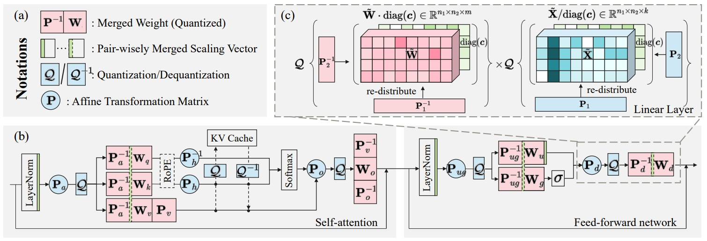
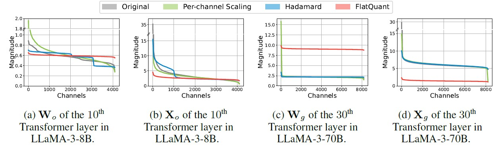

# FlatQuant: Flatness Matters for LLM Quantization

[](https://arxiv.org/abs/2410.09426)

This repository contains the PyTorch implementation of [FlatQuant: Flatness Matters for LLM Quantization](https://arxiv.org/abs/2410.09426).

---

FlatQuant leverages Fast and Learnable Affine Transformations tailored for each linear layer to alleviate outliers in LLMs. Additionally, as indicated by the name, it also achieves pretty flat weights and activations that are friendly to quantization. FlatQuant significantly enhances the quantization accuracy under a low-bit quantization setting (i.e., W4A4) while introducing little inference overhead, which may help promote the deployment of W4A4-quantized LLMs.



## News 🔥

- [2025/09] We add codes, results and instructions for real quantization, along with the pre-quantized models in HuggingFace, see [REALQUANT.md](REALQUANT.md).
- [2025/05] We now support **fake quantized inference** in **vLLM**.
- [2025/05] FlatQuant for **DeepSeek V3/R1** is now available!
- [2025/05] Our paper has been **accepted to ICML 2025**! 🎉
- [2024/11] Pre-trained transformation matrices of FlatQuant are now available at [modelzoo](#model-zoo).
- [2024/10] FlatQuant is **publicly released**! Check our paper [here](https://arxiv.org/abs/2410.09426).

## Contents

- [Preparations](#preparations)
- [Usage](#usage)
- [Model Zoo](#model-zoo)
- [Results](#results)
- [Acknowledgements](#acknowledgements)
- [References](#references)

## Preparations

### Installation

```bash
conda create -n flatquant python=3.10 -y
conda activate flatquant
pip install -r requirements.txt && pip install -e . && pip install triton==3.0.0
```

**Note:** To run models like LLaMA-3.1 or Qwen-2.5, we use `transformers==4.45.0` instead.

### Data Preparation

Download datasets in `./datasets`.

**Calibration set or PPL evaluation**

| Dataset   | Local Dir                  | URL                                                                                                                        |
| --------- | -------------------------- | -------------------------------------------------------------------------------------------------------------------------- |
| WikiText2 | ./datasets/wikitext        | [https://huggingface.co/datasets/wikitext](https://huggingface.co/datasets/wikitext)                                       |
| C4        | ./datasets/allenai/c4      | [https://huggingface.co/datasets/allenai/c4](https://huggingface.co/datasets/allenai/c4)                                   |
| Pile      | ./datasets/pile-val-backup | [https://huggingface.co/datasets/mit-han-lab/pile-val-backup](https://huggingface.co/datasets/mit-han-lab/pile-val-backup) |

**Commonsense QA evaluation**

For QA evaluation, we use local config files to specify the paths to local datasets. First, copy the dataset config files under `~/anaconda3/envs/flatquant/lib/python3.10/site-packages/lm_eval/tasks` to `./datasets/lm_eval_configs/tasks`. Next, modify the config item `dataset_path` in each QA dataset's config file to the local directory listed in the following table.

| Dataset         | Local Dir                 | URL                                                                                                                    |
| --------------- | ------------------------- | ---------------------------------------------------------------------------------------------------------------------- |
| ARC-E and ARC-C | ./datasets/ai2_arc        | [https://huggingface.co/datasets/allenai/ai2_arc](https://huggingface.co/datasets/allenai/ai2_arc)                                     |
| HellaSwag       | ./datasets/hellaswag      | [https://huggingface.co/datasets/Rowan/hellaswag](https://huggingface.co/datasets/Rowan/hellaswag)                                 |
| LAMBADA         | ./datasets/lambada_openai | [https://huggingface.co/datasets/EleutherAI/lambada_openai](https://huggingface.co/datasets/EleutherAI/lambada_openai) |
| PIQA            | ./datasets/piqa           | [https://huggingface.co/datasets/ybisk/piqa](https://huggingface.co/datasets/ybisk/piqa)                               |
| WinoGrande      | ./datasets/winogrande     | [https://huggingface.co/datasets/winogrande](https://huggingface.co/datasets/winogrande)                               |

### Model Preparation

Download models in `./modelzoo`.

| Model       | Local Dir                      | URL                                                                                                      |
| ----------- | ------------------------------ | -------------------------------------------------------------------------------------------------------- |
| LLaMA-2-7B  | ./modelzoo/llama-2/llama-2-7b  | [https://huggingface.co/meta-llama/Llama-2-7b](https://huggingface.co/meta-llama/Llama-2-7b)             |
| LLaMA-2-13B | ./modelzoo/llama-2/llama-2-13b | [https://huggingface.co/meta-llama/Llama-2-13b](https://huggingface.co/meta-llama/Llama-2-13b)           |
| LLaMA-2-70B | ./modelzoo/llama-2/llama-2-70b | [https://huggingface.co/meta-llama/Llama-2-70b](https://huggingface.co/meta-llama/Llama-2-70b)           |
| LLaMA-3-8B  | ./modelzoo/llama-3/llama-3-8b  | [https://huggingface.co/meta-llama/Meta-Llama-3-8B](https://huggingface.co/meta-llama/Meta-Llama-3-8B)   |
| LLaMA-3-70B | ./modelzoo/llama-3/llama-3-70b | [https://huggingface.co/meta-llama/Meta-Llama-3-70B](https://huggingface.co/meta-llama/Meta-Llama-3-70B) |

## Usage

### Pre-quantized models in HuggingFace & Real quantization codes and results

We provide the instruction for using the pre-quantized models in HuggingFace, along with the explanation of the real quantization code, results in [REALQUANT.md](REALQUANT.md).
These changes were introduced in the Issue [#24](https://github.com/ruikangliu/FlatQuant/issues/24) and PR [#27](https://github.com/ruikangliu/FlatQuant/pull/27).

### Calibration

We provide full script to run FlatQuant in `./scripts/`. We use LLaMa-3-8B as an example here:

1. Weight-Activation-KV Cache Quantization

```bash
# W4A4KV4
python ./main.py \
    --model ./modelzoo/llama-3/llama-3-8b \
    --w_bits 4 --a_bits 4 \
    --k_bits 4 --k_asym --k_groupsize 128 \
    --v_bits 4 --v_asym --v_groupsize 128 \
    --cali_bsz 4 --epoch 15 --flat_lr 5e-3 \
    --lwc --lac --cali_trans --add_diag \
    --output_dir ./outputs --save_matrix \
    --lm_eval --lm_eval_batch_size 16
```

2. Weight-Only Quantization

```bash
# W4A16
python ./main.py \
    --model ./modelzoo/llama-3/llama-3-8b \
    --w_bits 4 \
    --cali_bsz 4 --epoch 15 --flat_lr 5e-3 \
    --lwc --lac --cali_trans --add_diag \
    --output_dir ./outputs --exp_name wonly --save_matrix \
    --lm_eval --lm_eval_batch_size 16
```

3. Reproduce Evaluation Results of Our Paper
   
   1\) Download the pretrained FlatQuant parameters you want through [modelzoo](#model-zoo).
   
   2\) Inference with `--reload_matrix` and `--matrix_path PATH_TO_XXX`, take LLaMa-3-8B with W4A4KV4 quantization as an example:

```bash
python ./main.py \
    --model ./modelzoo/llama-3/llama-3-8b \
    --w_bits 4 --a_bits 4 \
    --k_bits 4 --k_asym --k_groupsize 128 \
    --v_bits 4 --v_asym --v_groupsize 128 \
    --cali_bsz 4 --epoch 15 --flat_lr 5e-3 \
    --lwc --lac --cali_trans --add_diag \
    --output_dir ./outputs --save_matrix \
    --lm_eval --lm_eval_batch_size 16 \
    --reload_matrix --matrix_path PATH_TO_XXX 
```


#### DeepSeek V3/R1 Scripts
For scripts related to **DeepSeek V3/R1**, see [`scripts/deepseek/`](./scripts/deepseek). Make sure to use the package versions specified in the DeepSeek V3 repository.

**Note**: We observed that the **last two layers of DeepSeek V3/R1** are difficult to quantize effectively.  
Use the flag `--v3_not_last` to skip calibration for these layers during quantization.

### Inference Latency

To measure the speedup of FlatQuant and our efficient kernel, run the corresponding benchmark commands provided below:

```bash
# Run end-to-end latency benchmark
python ./benchmarks/layer_benchmark.py
```

```bash
# Run kernel latency benchmark
python ./benchmarks/kernel_benchmark.py
```

```bash
# Run linear layer latency benchmark
python ./benchmarks/qlinear_benchmark.py
```

```bash
# Run attention latency benchmark
python ./benchmarks/qattention_benchmark.py
```

### Apply to other models

To apply FlatQuant in your own models, some modifications are required in the forward pass of the model, particularly within the Attention and MLP modules. You can refer to [flatquant/model_tools](flatquant/model_tools) for our implementations of LLaMA2, LLaMA3, LLaMA3.1, and Qwen2.5.

### Efficient Kernel

The detailed implementation of our efficient kernel can be found in [deploy/kernels/kron_matmul.py](deploy/kernels/kron_matmul.py) and [deploy/kernels/block_matmul.py](deploy/kernels/block_matmul.py).

### Plot Flatness

Run the following command to plot the flatness of weights and activations after different pre-quantization transformations including FlatQuant, Hdamard transformation and per-channel scaling. We use LLaMa-3-8B as an example here. The flag `--matrix_path` is used to specify the path to the pre-trained transformation matrices of FlatQuant.

```
python ./plot_flatness.py \
    --model ./modelzoo/llama-3/llama-3-8b \
    --distribute_model --add_diag \
    --matrix_path ./modelzoo/flatquant/llama-3-8b/w4a4
```



### Fake Quantization with vLLM

To enable fake-quantized inference with FlatQuant in a custom vLLM build, register the quantized models in your `inference.py` by adding:

```python
from vllm_custom.model_executor.fake_quantized_models.registry import register_fake_quantized_models
register_fake_quantized_models()  # Register fake-quantized models in vLLM
```

All code related to fake quantization is located in **`vllm_custom/`**.

## Model Zoo

We provide the pre-trained transformation matrices of FlatQuant at [https://huggingface.co/ruikangliu/FlatQuant](https://huggingface.co/ruikangliu/FlatQuant). The supported models are listed in the following table. For detailed implementations of each model, please refer to the code in `./flatquant/model_tools`.

| Model             | W4A4KV4          | W4A16KV16 |
| ----------------- | ---------------- | --------- |
| LLaMa-2           | ✅ 7B / 13B / 70B |           |
| LLaMa-3           | ✅ 8B / 70B       | ✅ 8B      |
| Qwen-2.5-Instruct | ✅ 7B / 32B       |           |
| DeepSeek          | ✅ V3 / R1        |           |

## Results

### Accuracy Results

**Table 1: WikiText-2 perplexity of 4-bit weight & acitvation quantized LLaMA models.**

| **Method**    | **W Quantizer** | **2-7B** | **2-13B** | **2-70B** | **3-8B** | **3-70B** |
| ------------- | --------------- | -------- | --------- | --------- | -------- | --------- |
| FP16          | -               | 5.47     | 4.88      | 3.32      | 6.14     | 2.86      |
| SmoothQuant   | RTN             | 83.12    | 35.88     | 26.01     | 210.19   | 9.60      |
| OmniQuant     | RTN             | 14.74    | 12.28     | -         | -        | -         |
| AffineQuant   | RTN             | 12.69    | 11.45     | -         | -        | -         |
| QuaRot        | RTN             | 8.56     | 6.10      | 4.14      | 10.60    | 55.44     |
| SpinQuant     | RTN             | 6.14     | 5.44      | 3.82      | 7.96     | 7.58      |
| **FlatQuant** | RTN             | **5.79** | **5.12**  | **3.55**  | **6.98** | **3.78**  |
| QUIK-4B       | GPTQ            | 8.87     | 7.78      | 6.91      | -        | -         |
| QuaRot        | GPTQ            | 6.10     | 5.40      | 3.79      | 8.16     | 6.60      |
| SpinQuant     | GPTQ            | 5.96     | 5.24      | 3.70      | 7.39     | 6.21      |
| **FlatQuant** | GPTQ            | **5.78** | **5.11**  | **3.54**  | **6.90** | **3.77**  |

**Table 2: C4 perplexity of 4-bit weight & acitvation quantized LLaMA models.**

| **Method**    | **W Quantizer** | **2-7B** | **2-13B** | **2-70B** | **3-8B**  | **3-70B** |
| ------------- | --------------- | -------- | --------- | --------- | --------- | --------- |
| FP16          | -               | 7.26     | 6.73      | 5.71      | 9.45      | 7.17      |
| SmoothQuant   | RTN             | 77.27    | 43.19     | 34.61     | 187.93    | 16.90     |
| OmniQuant     | RTN             | 21.40    | 16.24     | -         | -         | -         |
| AffineQuant   | RTN             | 15.76    | 13.97     | -         | -         | -         |
| QuaRot        | RTN             | 11.86    | 8.67      | 6.42      | 17.19     | 79.48     |
| SpinQuant     | RTN             | 9.19     | 8.11      | 6.26      | 13.45     | 15.39     |
| **FlatQuant** | RTN             | **7.79** | **7.09**  | **5.91**  | **11.13** | **7.86**  |
| QUIK-4B       | GPTQ            | -        | -         | -         | -         | -         |
| QuaRot        | GPTQ            | 8.32     | 7.54      | 6.12      | 13.38     | 12.87     |
| SpinQuant     | GPTQ            | 8.28     | 7.48      | 6.07      | 12.19     | 12.82     |
| **FlatQuant** | GPTQ            | **7.86** | **7.11**  | **5.92**  | **11.21** | **7.93**  |

**Table 3: Zero-shot QA task results of 4-bit weight & activation quantized LLaMA models.**

| **Method**    | **W Quantizer** | **2-7B**  | **2-13B** | **2-70B** | **3-8B**  | **3-70B** |
| ------------- | --------------- | --------- | --------- | --------- | --------- | --------- |
| FP16          | -               | 69.79     | 72.55     | 77.05     | 73.23     | 79.95     |
| QuaRot        | RTN             | 57.73     | 66.25     | 73.47     | 61.34     | 35.36     |
| SpinQuant     | RTN             | 63.52     | 68.56     | 75.09     | 66.98     | 65.66     |
| **FlatQuant** | RTN             | **67.96** | **71.42** | **76.62** | **71.23** | **79.01** |
| QuaRot        | GPTQ            | 65.01     | 68.91     | 75.68     | 65.79     | 70.45     |
| SpinQuant     | GPTQ            | 66.23     | 70.93     | 76.06     | 68.70     | 71.66     |
| **FlatQuant** | GPTQ            | **67.47** | **71.64** | **76.53** | **71.33** | **78.58** |

**Table 4: Results of 4-bit weight & activation quantized Qwen-2.5-Instruct models.**

| **Method**    | **W Quantizer** | **7B PPL (WikiText-2 / C4)** | **7B QA Avg.** | **32B PPL (WikiText-2 / C4)** | **32B QA Avg.** |
| ------------- | --------------- | ---------------------------- | -------------- | ----------------------------- | --------------- |
| BF16          | -               | 8.36 / 14.37                 | 70.75          | 5.32 / 10.45                  | 75.10           |
| QuaRot        | RTN             | -                            | -              | 6.95 / 12.17                  | 70.24           |
| QuaRot        | GPTQ            | -                            | -              | 6.54 / 11.65                  | 72.25           |
| **FlatQuant** | RTN             | **8.46** / **13.94**         | **68.62**      | **5.80 / 10.86**              | **74.89**       |

**Table 5: Results of 4-bit weight & activation quantized DeepSeek V3/R1 models.**

| **Model**        | **Quantization** | **C-Eval** | **MMLU** | **AIME2024** |
| ---------------- | ---------------- | ---------- | -------- | ------------ |
| DeepSeek V3-Base | FP8              | 90.10      | 87.10    | -            |
|                  | W4A4             | 89.59      | 86.32    | -            |
| DeepSeek R1      | FP8              | -          | -        | 79.8         |
|                  | W4A4             | -          | -        | 73.3         |

### Latency Results

**Table 6: Prefill speedup of LLaMA-2-7B model across different batch sizes on one RTX3090 GPU. We decode 256 tokens after the prefill on a sequence length of 2048.**

| **Batch Size** | **Int4** | **QuaRot** | **FlatQuant** |
| -------------- | -------- | ---------- | ------------- |
| 1              | 2.17     | 1.97       | 2.12          |
| 2              | 2.21     | 1.99       | 2.16          |
| 4              | 2.25     | 2.04       | 2.21          |
| 8              | 2.28     | 2.05       | 2.23          |
| 16             | 2.32     | 2.08       | 2.27          |
| 32             | 2.35     | 2.09       | 2.28          |
| 64             | 2.37     | 2.11       | 2.30          |

**Table 7: Decoding speedup of LLaMA-2-7B model across different batch sizes on one RTX3090 GPU. We decode 256 tokens after the prefill on a sequence length of 2048.**

| **Batch Size** | **Int4** | **QuaRot** | **FlatQuant** |
| -------------- | -------- | ---------- | ------------- |
| 1              | 0.81     | 0.70       | 0.71          |
| 2              | 0.78     | 0.66       | 0.69          |
| 4              | 0.82     | 0.74       | 0.73          |
| 8              | 0.97     | 0.83       | 0.83          |
| 16             | 1.18     | 1.01       | 1.05          |
| 32             | 1.50     | 1.38       | 1.43          |
| 64             | 1.83     | 1.75       | 1.76          |

## Acknowledgements

This project is based on the work of the following projects:

- [QuaRot](https://github.com/spcl/QuaRot)
- [OmniQuant](https://github.com/OpenGVLab/OmniQuant)
- [IntactKV](https://github.com/ruikangliu/IntactKV)

We are grateful for the contributions provided by these projects.

## References

If you find FlatQuant helpful, please cite our paper:

```
@article{sun2024flatquant,
  title={FlatQuant: Flatness Matters for LLM Quantization},
  author={Sun, Yuxuan and Liu, Ruikang and Bai, Haoli and Bao, Han and Zhao, Kang and Li, Yuening and Hu, Jiaxin and Yu, Xianzhi and Hou, Lu and Yuan, Chun and others},
  journal={arXiv preprint arXiv:2410.09426},
  year={2024}
}
```
